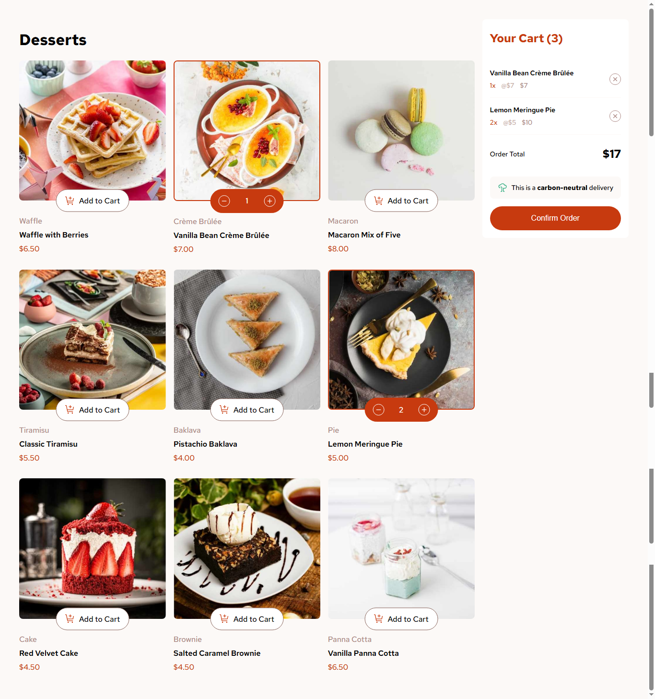
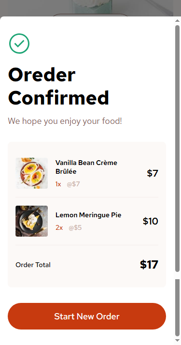

# Frontend Mentor - Product list with cart solution (React)

This is a solution to the [Product list with cart challenge on Frontend Mentor](https://www.frontendmentor.io/challenges/product-list-with-cart-5MmqLVAp_d). Frontend Mentor challenges help you improve your coding skills by building realistic projects.

## Table of contents

- [Overview](#overview)
  - [The challenge](#the-challenge)
  - [Screenshot](#screenshot)
  - [Links](#links)
- [My process](#my-process)
  - [Built with](#built-with)
  - [What I learned](#what-i-learned)
  - [Useful resources](#useful-resources)

## Overview

### The challenge

Users should be able to:

- Add items to the cart and remove them
- Increase/decrease the number of items in the cart
- See an order confirmation modal when they click "Confirm Order"
- Reset their selections when they click "Start New Order"
- View the optimal layout for the interface depending on their device's screen size
- See hover and focus states for all interactive elements on the page

### Screenshot




### Links

- Live Site URL: [Product cart](https://somaia02.github.io/product-list-with-cart-main/)

## My process

### Built with

- Semantic HTML5 markup
- CSS custom properties
- Flexbox
- CSS Grid
- Mobile-first workflow
- [React](https://reactjs.org/) - JS library

### What I learned

I learned how to modify react types.

```js
import "react";
declare module "react" {
  interface ButtonHTMLAttributes {
    command?: string;
    commandfor?: string;
  }
}
```

I learned how to limit the scope of the anchor.

```css
.product-card {
  anchor-scope: --product-img;
}
```

### Useful resources

- [Using `<dialog>`](https://developer.mozilla.org/en-US/docs/Web/HTML/Reference/Elements/dialog) - This helped me how touse and style the `<dialog>` element.
- [Using anchor position](https://www.youtube.com/watch?v=lXS2P3xtAUY) - This helped me fix the issue where all the anchor-positioned buttons were stacking on one card.
